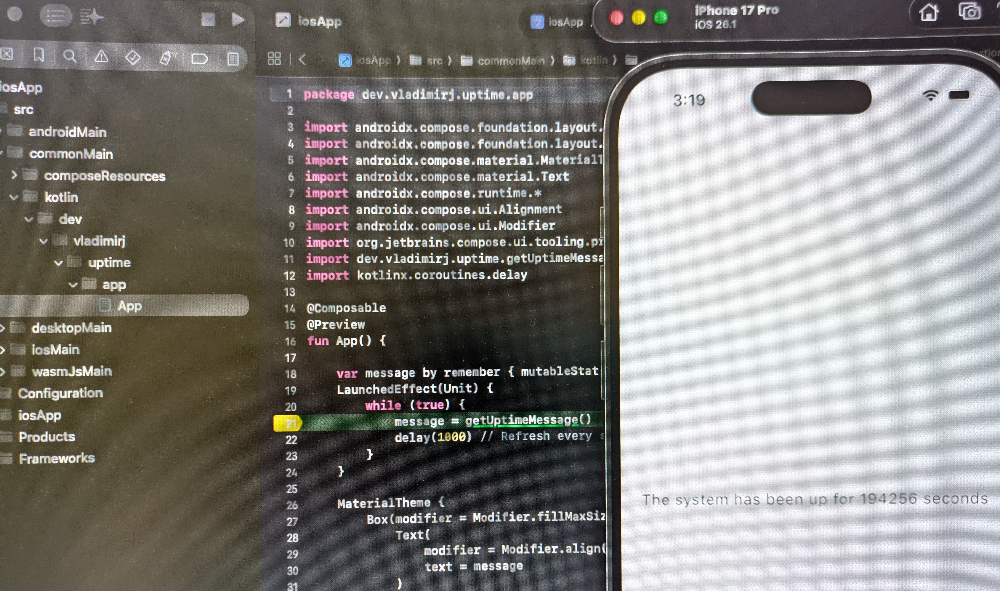
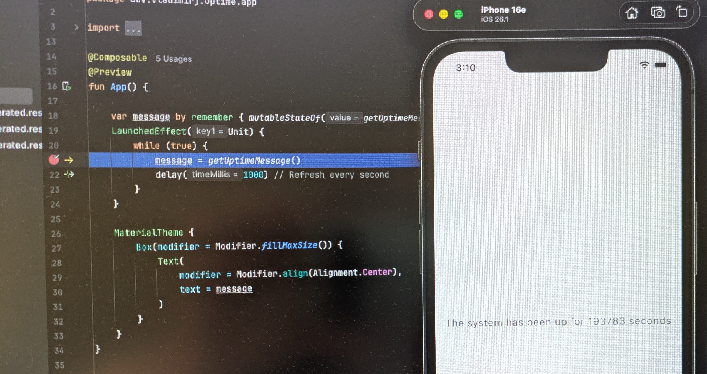

# Logic sharing between iOS, Android and Web

This repository does what the title says, using a Kotlin Multiplatform library.

In 2026, the developer experience is excellent, e.g. I can set breakpoints within the shared code without any Xcode plugin, and I can also chose to run and debug the iOS version from within Android Studio with the KMP plugin.

## KMP notes

 - notable libraries you can use in `commonMain`: [Koin](https://kotlinlang.org/docs/multiplatform/multiplatform-connect-to-apis.html#dependency-injection-framework), [ViewModel](https://kotlinlang.org/docs/multiplatform/compose-viewmodel.html), [Nav3](https://kotlinlang.org/docs/multiplatform/compose-navigation-3.html), Ktor, Kotlinx.serialization, Apollo, SQLDelight, Kermit (logging), Kotlinx-datetime, Multiplatform-settings
 - other KMP libs are at https://klibs.io/
 - any resources can go into `commonMain->composeResources`, e.g. vector drawables, translated strings, fonts
 - make sure you turn off configuration cache for release publishing
 - the best way of sharing the source with iOS devs working in Xcode is by publishing a podspec file via `./gradlew :library:podspec`; use Swift Export to allow Kotlin calling in Swift directly
 - keep in mind Swift interop, e.g. [on suspend functions](https://kotlinlang.org/docs/native-objc-interop.html#suspending-functions) and [on error annotations](https://kotlinlang.org/docs/native-objc-interop.html#errors-and-exceptions)
 - wasmJs generates a .wasm binary, .d.ts types and JS loader (which consumers need to explicitly call) 
